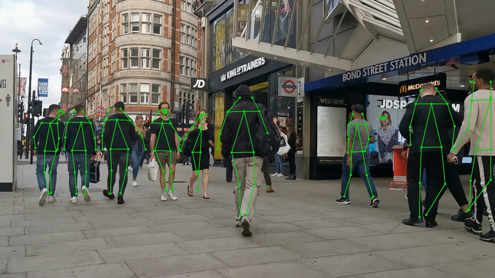

# Nvidia's trt_pose Inference

This repo is for beginners who want to test Nvidia's trt_pose pose estimation.




To get started, follow the instructions below.  If you run into any issues please [let us know](../../issues).

## Getting Started

To get started with trt_pose, follow these steps.

### Step 1 - Install trt_pose and torch2trt

Please follow instructions on official Nvidia's [trt_pose](https://github.com/NVIDIA-AI-IOT/trt_pose) 's repo to requirements and [torch2trt](http://github.com/NVIDIA-AI-IOT/torch2trt) - An easy to use PyTorch to TensorRT converter.

> Move the pretrained models into the [tasks/human_pose/pretrained](tasks/human_pose/pretrained) directory.
    
### Step 2 - Convert the model to tensorrt model

If you have problem installing torch2trt, you can skip this step.

```python
cd trt_pose/tasks/human_pose
python convert_trt.py --model pretrained/densenet121_baseline_att_256x256_B_epoch_160.pth --json human_pose.json --size 256
```
> You can find the size of input image in the name of your model file.

### Step 3 - Run Inference code

There are two modes to test : input a video and test with your webcam.

If you passed step-2, run this:
```python
python inference.py --trt_model pretrained/densenet121_baseline_att_256x256_B_epoch_160_trt.pth --json human_pose.json --size 256 --video_input test.mkv
```

If you skipped step-2, run this:
```python
python inference.py --trt_model pretrained/densenet121_baseline_att_256x256_B_epoch_160.pth --json human_pose.json --size 256 --video_input test.mkv
```


Above Image is tested with video from https://www.youtube.com/watch?v=YzcawvDGe4Y.


